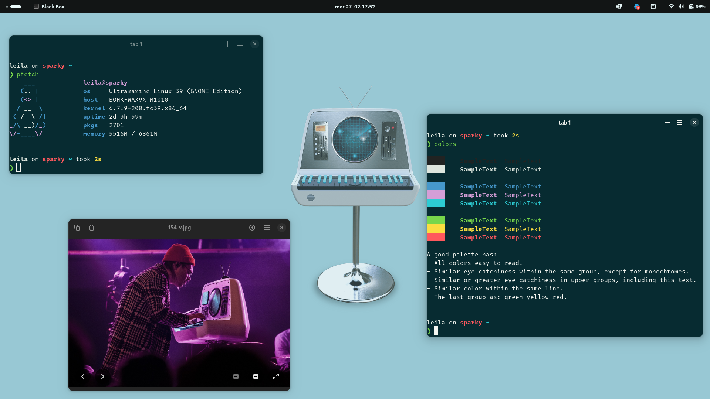

# Sparky


Sparky is a colour palette/theme inspired by Enter Shikari's [The Spark](https://album.link/mx/i/1263896001) made with aesthetics and PMS compliance in mind. It features a range of 29 colours, and resembles palettes like Solarized or Nord.

Its palette was swatched from Enter Shikari album covers (TS and NiR&EiP), completed using a harmonic colour wheel, adjusted for contrast balance; and accessibility for colourblind users, and then matched to their closest Pantone equivalents.

## Palette
Sparky has in total 29 colours, 8 "main", 8 "bright", 4 "background", a scale of 6 greys, 2 extra colours for editors, and a foreground.

Name/Use | PMS | Hex | 🎨
---|---|---|---
Red | 178 C | `#FF585D` | 
Orange | 2013 U | `#FF9F24` | 
Yellow | 114 C | `#FBDD40` | 
Green | 7488 C | `#78D64B` | 
Cyan | 319 C | `#2DCCD3` | 
Blue | 660 C | `#407EC9` | 
Purple | 2583 C | `#A05EB5` | 
Brown | 4645 C | `#AD7C59` | 
Red (Bright) | 805 C | `#FF7276` | 
Orange (Bright) | 804 C | `#FFAA4D` | 
Green (Bright) | 7487 C | `#8EDD65` | 
Yellow (Bright) | 100 C | `#F6EB61` | 
Cyan (Bright) | 2199 C | `#00BBDC` | 
Blue (Bright) | 292 C | `#69B3E7` | 
Purple (Bright) | 211 C | `#F57EB6` | 
Brown (Bright) | 4655 C | `#BF9474` | 
Background | 546 C | `#072B31` | 
Background (Dark) | 296 C | `#041C2C` | 
Background (Bright) | 547 CP | `#003C46` | 
Background (Brighter) | 3145 C | `#00778B` | 
Selection | 547 C | `#00313C` | 
Comments | 3155 C | `#006272` | 
Foreground | 546 C | `#f4f5f0` | 

There is also a scale of greys which are not PMS-compliant, however they were added in order to allow for more detail when theming and as a buffer for some themes.

Hex | 🎨
`#FFFFFF` | 
`#D3D3D3` | 
`#A6A7A7` | 
`#7A7B7A` | 
`#4D4F4E` | 
`#212322` | 

### Accessibility
Sparky was originally designed with accessibility in mind, prioritising colourblind distinctions and contrast balancing, and attempting to reduce eye sore. As Sparky's palette grew from 10 colours to 16, 18, 24, and now 29 colours; this became a harder task to balance out.

Sparky's entire palette is not colourblind safe, only its "main" variant, and its background/extra colours have been tested to be colourblind safe. Sparky still tries its best at being colourblind safe, with fairly noticeable contrast between all variants, but it might be difficult to tell colours apart for some users with more extreme cases of colourblindness.

Sparky is designed to be as readable and usable as possible in all kind of scenarios, making contrast a priority, and attempts to have all of its colours fit within AA (4.5:1) level under WCAG guidelines when compared against its background colour.

Sparky averages a [WCAG 2.1](https://www.w3.org/TR/WCAG21/#contrast-minimum) contrast rating of 7.5:1 (AAA).

## Install
Sparky was planned as only a colour palette to build themes from, so there aren't any "official" Sparky themes.

However, Sparky themes are available in a few odd ways, mainly for terminals.

### Base16 and Base24
Sparky is available as a Base16 and as a Base24 scheme; refer to [`sparky16.yml`](src/sparky16.yml) for Base16, or [`sparky24.yml`](src/sparky24.yml) for Base24.

Using BaseXX versions allow you to import Sparky into basically anything with a Base16/24 builder/manager like [Tinty](https://github.com/tinted-theming/tinty) or [Themix](https://github.com/themix-project/themix-gui) for theming.

Note that due to Base16 only using 16 colours (who would've guessed) and due to its format, bright variants of colours and darks were removed.

### Gogh
[Gogh](https://gogh-co.github.io/Gogh/) is a repository of themes for many terminal emulators that can be installed running a single command and picking a theme. You can find Sparky there.

```
bash -c  "$(wget -qO- https://git.io/vQgMr)"
```

### terminal.sexy
Although in a limited manner, you can use [terminal.sexy](https://terminal.sexy) to get Sparky themes for many terminal emulators. You can also fine tune and customise Sparky's colours to your liking.

For this you need to import [`sparky.xresources`](src/sparky.xresources) into terminal.sexy.

### Community-sourced Themes
You can find Sparky community themes searching for [#sparky-theme](https://github.com/search?q=sparky-theme) in Github.

Currently there are none but one can have dreams.

## Credits
This theme was possible thanks to the following tools and people:
- [Adobe Color](https://color.adobe.com/) - used for its colour wheel and colourblind safety checks
- [Eric's Color Blender](https://meyerweb.com/eric/tools/color-blend/) - used alongside AC's colour wheel to find colours
- [iColorpalette](https://icolorpalette.com) - used for converting HEX codes for Pantone and finding alternative shades
- [Color Designer](https://colordesigner.io) - used for its compare colours tool, which was essential for finding lighter and darker shades
- [terminal.sexy](https://terminal.sexy/) - used for live-testing
- [Enter Shikari Discord](https://discord.com/invite/yuPuTsQARE) - for encouraging me to continue developing the scheme
- [@tinted-theming](https://github.com/tinted-theming) - for hosting info, schemes and tools for B16/24
- [@maisymoe](https://github.com/maisymoe) - for getting me into Enter Shikari, and saving my life

## License
Sparky is released under the [Unlicense](https://unlicense.org) license, meaning that Sparky is released under the public domain, and you can do literally anything you want with the files provided here and the colour scheme swatched by me.